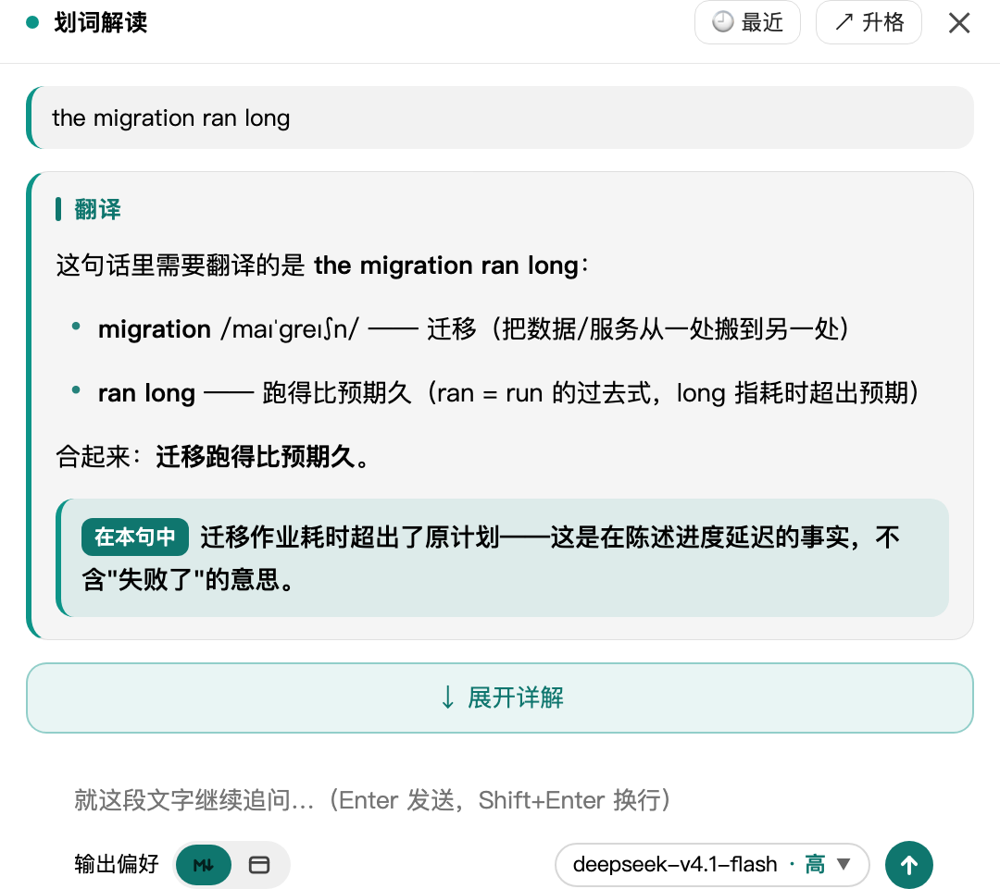
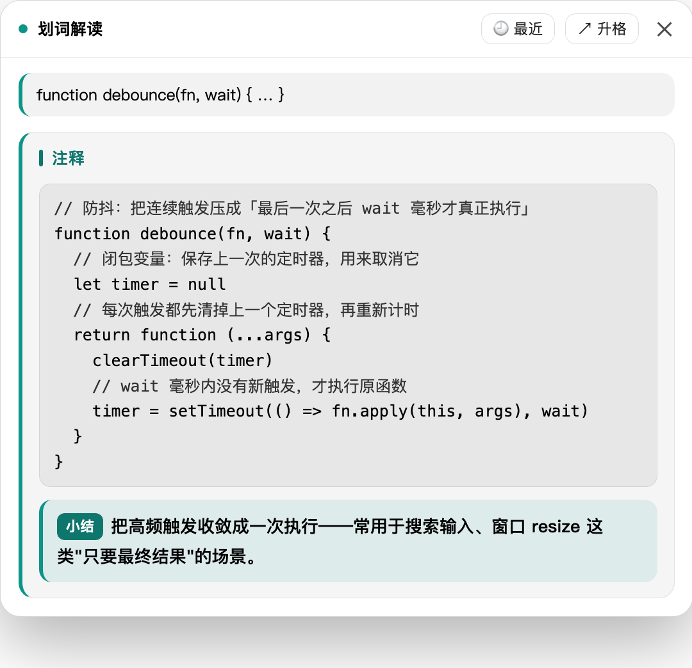
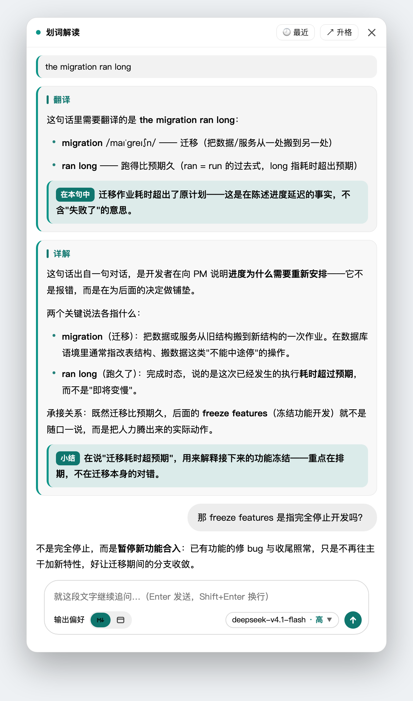
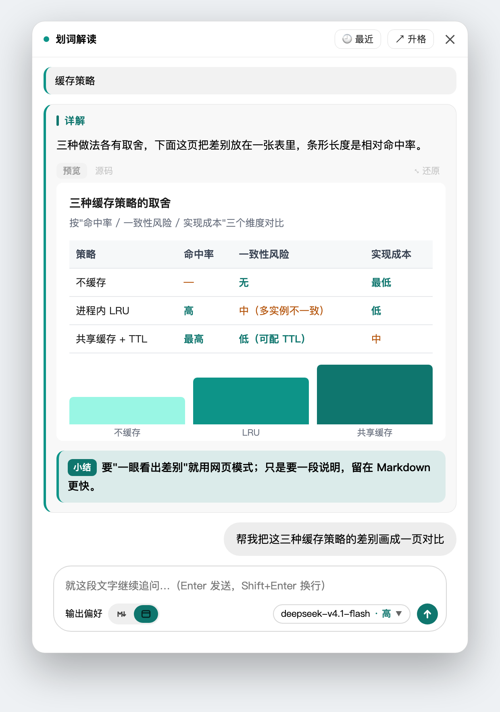

# dsh-selection-explain · 划词解读

> 在 [DSH](https://github.com/deepseek-ai) Web 界面里**选中任意文字**，就地得到**专业翻译** + **这段文字在当前上下文里到底是什么意思**，还能接着追问、或一键升格成正式会话。

[](https://github.com/yfwu2020/dsh-selection-explain/releases)
[](https://www.npmjs.com/package/@yfwu2020/dsh-selection-explain)
[](./package.json)
[](https://github.com/yfwu2020/dsh-selection-explain)

---

## 它解决什么问题

读英文文档、看代码注释、翻聊天记录时，卡住的往往不是"这个词什么意思"，而是**"它在这里什么意思"**：

- `commit` 是"提交"还是"承诺"？`stale closure` 在这个 bug 报告里指哪种闭包？
- 同事写的 "let's circle back on the migration" 到底在安排什么？
- 这段报错里的 `EADDRINUSE`，在当前这个项目里是端口冲突还是残留进程？

普通翻译工具只给词义，**不给语境**。这个插件把**选中文字 + 它周围的内容 + 当前会话的对话背景**一起喂给模型，所以答案能落到"这里"——并且它知道你是在读文档、读代码，还是在跟人对话。

## 功能

### 两段式：先快后深

点开面板**先只出翻译**（上下文窗口收窄到 8 条消息，首字最快）；翻译出来后才出现 **`↓ 展开详解`**，点了才用完整会话背景（24 条消息）做深度解读。想要快就停在第一段，想要透就展开——**不强迫你为深度等首字**。



### 翻译：按选中内容的语言和形态自适应

不是无脑翻译，而是先判断这段文字是什么，只给对应的那一种：

| 选中内容 | 输出 |
| --- | --- |
| 中文句子（夹英文） | 中文部分**不翻译**，只把句中夹着的英文片段逐条译成中文 |
| 中文词 / 词组 | 列常用义项（每行一条） |
| 英文句子 / 词组 | 直接给中文译文 |
| 英文单词 | 逐个义项一行，**带音标** |
| 日 / 韩 / 法 / 德等其他语言 | 译成中文 |

最后固定给一条**结论条**：`> 在本句中：<它在这里的确切含义>`，面板里渲染成高亮条，一眼看到答案。

### 详解：讲透"在这里"的意思

- **先判断来源**：这段文字是真实内容，还是示例 / 测试用例 / 演示输出 / 引用别人的话？是后者就先点明（否则示例句会被当成真实陈述去解释）。
- **专业名词两层讲**：先给通用含义（本领域标准定义或全称），再说它在这段上下文里具体指什么。
- **讲透承接关系**：关键说法各指什么、承接了什么、能推出什么。
- **可以联网**：拿不准或是新出现的名词、缩写、产品名，会先搜索确认再解释，事实融进解释里，不罗列搜索过程。

### 选中代码 → 出注释

如果选中的是代码（在 `<pre>/<code>` 里，或文本特征像代码），首轮标题变成「**注释**」：整个回答是一个代码块，里面是**注释 + 原代码交替**的批注清单——每条语句**前面**一行该语言的注释符号（`//`、`#`、`--`、`<!--`…），原代码逐字不变。注释行弱化显示，一眼分得清哪行是代码、哪行是批注。缩进按原行起始列对齐，折行也不会跑到注释左边。



### 临时对话小窗

翻译一出来就能直接追问，不必先展开详解：

- 输入框 `Enter` 发送、`Shift+Enter` 换行（中文输入法确认候选词的 Enter 不会误发）。
- 回答流式出现，多轮上下文保留。
- 追问可以**联网查证**，但工具日志不进小窗——只给你模型消化后的结论。
- 生成中可以点**停止**打断；没有可用结果时给「重新生成」。
- 关掉面板**不会丢**：点右下角胶囊原样回来，不重新请求。



### 输出偏好：Markdown ↔ 网页

输入区左下角那个两格开关（`M↓` = Markdown / `▭` = 网页）决定**追问的回答用什么形式**。默认是 **Markdown**，选择记在浏览器本地，下次打开还是它。

| 档位 | 行为 |
| --- | --- |
| **Markdown**（默认） | 普通文字 / Markdown 回答——标题、列表、表格、代码块都可以。**并不禁止 HTML**：如果某个问题用一页网页明显讲得更清楚，照样会给网页；只是不会为了"好看"把简单问题做成页面 |
| **网页** | **网页优先**（不是"一律网页"）：需要对比、流程、层级、图表，或文字答案会长到不好读 → 直接给**完整的单文件 HTML**，页面本身就是答案；一两段话能说清的简单问题**仍然用文字回答** |



**网页输出的优点**（也是它值得单独一档的原因）：

- **复杂信息能"看"而不是"读"**：三种方案的取舍做成对照表 + 条形图，一眼看出差别；文字版要读三段才建立同样的印象。
- **页面就是答案，不是附件**：生成的是**完整单文件 HTML**（样式与脚本全内联），小窗当场渲染成可交互页面——能悬停、能点、能滚，不用保存成文件再打开。
- **两个视图随时切**：回答上方有 `预览 / 源码` 两个页签，切到源码就能把 HTML 拿走。
- **默认就整页展示**：预览高度**由页面内容决定**（内部不滚动），所以一页对比表能完整看下来；想收起来点右侧 **`⤡ 还原`**，回到固定高度（320px、内部滚动）。
- **有设计规范兜底**：开网页模式时，插件会把自己带的 `skills/web-design/SKILL.md` 注入提示词——按小窗**约 500px 宽的窄容器**写的单列布局规范，避免生成那种"三栏卡片 + 渐变大标题"的通用 AI 模板感。（该文件读不到时有一份内置兜底，不会因此失败。）
- **回答仍然可追问**：网页结果会作为前情带回下一轮，可以继续说"把第二列改成时间线"。

**什么时候别用网页**：只想要一段解释、或要的是可以直接复制的文本时，Markdown 更快也更省 token——网页要生成一整份 HTML，等待时间和输出长度都更大。

### 「最近聊过的」历史

面板头部 `🕘 最近` 打开独立浮层列表（贴面板侧边，空间不够自动翻到另一侧）。重划同一个词**直接回放上次的对话，一次模型都不调**。默认保留最近 20 个划词条目（每个条目含它自己的全部追问），LRU 淘汰，**升格过的条目不会被淘汰**。

历史落在 `~/.dsh/selection-explain/history.json`，**不建会话**——不污染你的会话列表。

### 升格为正式会话

面板头部 `↗ 升格` 把这次解读（选中文字 + 翻译 / 详解 + 全部追问）变成一个正式会话，建在**来源会话同一个项目下**。临时小窗聊出价值了，就把它变成正式的。

### 悬浮状态胶囊

右下角一枚胶囊显示"最近一次划词现在什么状态"（进行中报阶段和秒数、其余报结果），点一下回到那个小窗。它会自动贴到费用胶囊上方。

### 零依赖渲染

面板自带 Markdown 渲染器（段落、多级列表、小标题、表格、引用、代码块）和**语法高亮 tokenizer**（自研，零依赖）：注释 / 字符串 / 数字 / 关键字 / 函数名 / 类型 / 标签 / 属性 / 变量 / 运算符分色，按围栏语言标记选规则。配色跟随**面板实际底色**判定，不是看系统偏好——所以 App 深色 + 系统浅色也不会出现深底配深字。文字对比度实测全部 ≥ WCAG AA 4.5。

<!--
  上面几张演示图的来源（要换图看这里）：
  · 图由 scripts/build-demo-pages.mjs 生成演示页 —— 样式直接从 lib/client.js 抽取真实 CSS，
    DOM 结构与文案照 src/client/index.js 的渲染器写，所以和真实面板一致（非手绘示意图）。
  · 截图：Chrome 无头（--headless --screenshot --force-device-scale-factor=2）
  · 裁边：node scripts/crop-png.mjs <in.png> assets/<name>.png 24
  · 想换成真实环境截图，直接用同名文件覆盖 assets/ 下的图片即可。
-->

---

## 安装

### 方式一：从 npm 安装

已发布到 npm registry：

```bash
npm install @yfwu2020/dsh-selection-explain
# 或直接装配进 profile（npm 包名可直接用）
dsh plugin --profile web add @yfwu2020/dsh-selection-explain
```

### 方式二：从 Release 安装

每个 Release 都附了**构建好的 `.tgz`**（含 `lib/` 产物，装完即可用，无需 clone 源码）。
用 `latest` 路径可以不写版本号、永远取最新：

```bash
# 下载最新 release 的安装包（无需知道版本号）
VER=$(curl -sI https://github.com/yfwu2020/dsh-selection-explain/releases/latest | grep -i '^location:' | sed 's|.*/tag/v||' | tr -d '\r\n')
curl -LO "https://github.com/yfwu2020/dsh-selection-explain/releases/download/v$VER/yfwu2020-dsh-selection-explain-$VER.tgz"

# 解包到插件目录
mkdir -p ~/.dsh/plugins/dsh-selection-explain
tar -xzf "yfwu2020-dsh-selection-explain-$VER.tgz" \
  -C ~/.dsh/plugins/dsh-selection-explain --strip-components=1

# 装配到 profile（重启后由官方接管）
dsh plugin --profile web add ~/.dsh/plugins/dsh-selection-explain
```

> 也可以直接下某个固定版本，把上面的 `$VER` 换成版本号即可，例如
> `.../releases/download/v0.1.2/yfwu2020-dsh-selection-explain-0.1.2.tgz`。

### 方式三：从源码安装

```bash
git clone git@github.com:yfwu2020/dsh-selection-explain.git
cd dsh-selection-explain

# 装依赖（编译用的 @deepseek-ai/* 类型与 tsc 都在 devDependencies 里）
npm install

# 构建（自动探测 DSH 运行时；host 走 tsc，client 是手写 bundle 直接拷贝）
bash scripts/build.sh

# 装配
dsh plugin --profile web add .
```

> `scripts/build.sh` 会按顺序探测 DSH 运行时：**项目自己的 `node_modules`**（CI/`npm install` 走这条）
> → `DSH_CHECKOUT` → PATH 上的 `dsh` → 常见 checkout → npx 缓存。
> 探测不到时可以显式指定：`DSH_CHECKOUT=/path/to/dsh-harness bash scripts/build.sh`。

装好后**刷新页面**，选中文字试试。浏览器控制台会打印 `[dsh-selection-explain] 划词解读已就绪（选中文字试试）`。

### 卸载

```bash
dsh plugin --profile web remove @yfwu2020/dsh-selection-explain
```

---

## 用法

| 动作 | 结果 |
| --- | --- |
| **鼠标划选** / `Shift` + 方向键 | 选区末端浮出 `✦ 解读` 药丸按钮（✦ 是图标，按钮文字是「解读」；输入框内的选择不触发，避免干扰打字） |
| 点击按钮 | 弹出面板：顶部是选中文字，正文是「翻译」卡片 |
| 点 `↓ 展开详解` | 加载完整会话背景，追加「详解」卡片 |
| 面板底部输入框 | 就这段文字继续追问（`Enter` 发送 / `Shift+Enter` 换行） |
| `🕘 最近` | 打开最近划过的列表，点一条调回那段对话 |
| `↗ 升格` | 把这次解读变成正式会话 |
| `✕` / `Esc` | 关闭面板（**任何时候都能关**，一次到位） |
| 右下角悬浮胶囊 | 点一下：关着就回到最近一次小窗，开着就收起（来回切换，不重新请求） |

**几个不别扭的细节：**

- **点面板外不会关闭面板**。答案留在原地，只有 `✕` / `Esc` / 右下角胶囊能收起——不会因为手滑点一下就得重新问。
- 关闭时**会中止正在飞的请求**，并记成「已停止」（不是失败）；内容都留着，点胶囊回来还是原样。
- 拖动面板：抓头部即可拖动。
- 追问时消息区**贴底跟随**；你主动往上翻就不会被拽回去。
- `🕘 最近` 的列表点别处就收（不连带关面板），但 `Esc` 会把面板和它一起收。

### 调试钩子

浏览器控制台里可以直接驱动，方便验证渲染链路：

```js
window.__dshSelectionExplain.open('the migration ran long', 'Dev: the migration ran long, so we ship Wednesday.')
window.__dshSelectionExplain.state()   // { phase, chars, model, sections }
window.__dshSelectionExplain.ping()    // 当前模型路由与限制
```

### HTTP 接口

host 半注册了同源路由，可以单独调用：

| 路由 | 说明 |
| --- | --- |
| `POST /selection-explain/api/analyze` | 选中文字 + 上下文 → **SSE 流式**返回翻译与详解 |
| `GET /selection-explain/api/ping` | 健康检查：当前模型路由、各阶段推理档位、限制 |
| `GET /selection-explain/api/models` | 可选模型列表（面板里的模型选择器用） |
| `GET/POST /selection-explain/api/history` | 小窗对话历史的读 / 写 / 删除 |
| `POST /selection-explain/api/promote` | 升格为正式会话 |

健康检查示例：

```bash
curl -s http://127.0.0.1:3080/selection-explain/api/ping
```

---

## 配置

配置写在 profile 的 `cordis.patch.yml` 里同 id 的行上（`dsh plugin add` 装好后，包自带的 `cordis.patch.yml` 里已有可改的样板）：

```yaml
- insert:
    - id: selection-explain
      name: '@yfwu2020/dsh-selection-explain'
      config:
        reasoningEffort: high
        sessionContextMaxMessages: 24
```

**下表默认值取自 `src/index.ts` 的 `Config` schema，也就是推荐值。** 不填即用默认。

### 模型与推理

| 字段 | 默认 | 说明 |
| --- | --- | --- |
| `provider` | `''` | 固定 provider 路由；留空 = 跟随「设置 → 默认模型」 |
| `model` | `''` | 固定 model id；留空 = 跟随默认模型 |
| `reasoningEffort` | `high` | **详解**阶段推理档位（`off` / `low` / `high` / `max`） |
| `translationReasoningEffort` | `low` | **首轮翻译**单独一档。这一轮只需挑英文片段，压低换首字速度 |
| `chatReasoningEffort` | `high` | **追问**档位（追问要准不要快；想更快可调 `low`） |
| `temperature` | `-1` | 采样温度。**`-1` = 不传**，交给供应商默认（与主会话一致）；`0`~`2` 之间才真的传 |
| `maxTokens` | `0` | 单次输出上限（tokens）。**`0` = 不限制**。填正数可控成本 / 控时延 |
| `timeoutMs` | `300000` | 单次调用超时（含工具轮；客户端断开即中止上游） |

> 推理档位三档分开是有原因的：翻译不需要深度推理，详解需要。默认 `translationReasoningEffort: low` 让首字快、`reasoningEffort: high` 让详解细。

### 上下文与缓存

| 字段 | 默认 | 说明 |
| --- | --- | --- |
| `maxSelectionChars` | `4000` | 选中文字长度上限（超了不出现按钮，host 侧也会拦截并给出明确报错） |
| `maxContextChars` | `12000` | 局部上下文上限（选区前后各取一段窗口） |
| `sessionContext` | `true` | 是否注入当前会话的对话背景（判断指代与前提的关键） |
| `sessionContextFastMessages` | `8` | **首轮翻译**用的背景条数；越小首字越快 |
| `sessionContextMaxMessages` | `24` | **详解 / 追问**用的背景条数（自选中文字所在消息向上取） |
| `sessionContextMaxChars` | `0` | 会话背景字符上限；**`0` = 不限**（只按条数取窗口） |
| `resultCacheTtlMs` | `600000` | 共享结果缓存 TTL（毫秒）；`0` = 关闭 |
| `historyMaxEntries` | `20` | 小窗对话历史保留多少个划词条目；`0` = 关闭历史 |
| `maxRequestsPerMinute` | `40` | 本地限流，防误触发刷爆额度 |

### 工具（联网 / 文件）

| 字段 | 默认 | 说明 |
| --- | --- | --- |
| `tools` | `true` | 是否允许解读过程调用工具 |
| `toolNames` | `advanced_search,platform_search,read,grep,glob` | 工具白名单（逗号分隔）。默认用 free-search 插件的搜索工具，支持多引擎、时间过滤、平台搜索 |
| `fallbackToolNames` | `web_search` | **备用**清单：只在首选里的联网工具一个都不在时才补进来（没装 free-search 时兜底） |
| `maxToolRounds` | `2` | 最多几轮工具调用（用完会补一轮不带工具的收尾，避免"转半天没回答"） |
| `toolResultMaxChars` | `3000` | 单个工具结果注入模型前的字符上限 |
| `toolReadRoot` | `''` | 文件类工具（`read`/`grep`/`glob`）的读取边界：`''` = 会话工作目录，`'*'` = 不限制，其他 = 指定目录。越界在**执行前**被拒 |

---

## 工作原理

```
浏览器（client half，挂在官方 shell.overlay 槽 —— 帧级浮层，不遮挡 App）
  ① 监听 selection（mouseup / Shift+方向键）→ 在选区末端定位浮标
  ② 点击后采集三段信息：
     · 局部上下文：选区所在容器文本中，选区前后各 1500 字的窗口，【】标出选中部分
     · 所在位置：容器类型（对话消息 / 代码块 / 表格 / 页面内容）+ 页面标题与地址
     · 当前会话 id
  ③ POST /selection-explain/api/analyze → SSE 边收边渲染
                                            ↓
宿主（host half，进程内）
  ④ 解析模型路由：默认取「设置 → 默认模型」
  ⑤ 会话背景：按会话 id 读该会话的真实对话（工具调用 / 系统提示 / harness 注入内容全部剔除），
     从最新往前取到预算上限，并把选中文字所在的那条标 ▶
  ⑥ 组两节提示词 → ctx.llm.stream(...) → text-delta 直接透传 SSE
     （reasoning-delta 另走 thought 事件，只喂"正在想什么"那一行，不参与正文）
```

**几个设计取舍：**

- **不建会话**：小窗对话落在插件自己的 `history.json` 里。会话是重型对象，高频功能那样做只会堆死会话列表。
- **缓存 key 不含选中文字之后的内容**：否则主会话后面追加新消息时，同一个词的 key 就变了，表现为"找不着上次的小窗、又生成一个"。
- **上下文窗口锚定选中文字所在的那条消息**，向上取——不是简单取最近 N 条，这样"这个词在这段对话里什么意思"才有前提。

---

## 自检与开发

```bash
npm run build       # 构建（= bash scripts/build.sh）
npm test            # 489 条断言（filters / prompt / client / transcript / guard）
npm run typecheck   # tsc --noEmit
```

| 脚本 | 用途 |
| --- | --- |
| `scripts/test-client.mjs` | 无浏览器集成测试：真实 host 路由 + 最小 DOM 桩，覆盖槽注册 → 划词浮标 → 点击 → SSE 流式渲染 → 两节内容 → 清理（host 不在跑时自动跳过在线断言） |
| `scripts/test-prompt.mjs` | **提示词契约测试**：把两节结构标题、结论条格式、音标规则、详解来源判断、追问网页模式要求等关键约束固化成断言，误删即 CI 红 |
| `scripts/test-filters.mjs` | host 侧流式过滤器单测（思考泄漏、工具调用残渣等） |
| `scripts/test-transcript.mjs` | 会话背景窗口的离线测试（锚点 / 条数 / 不截断 / 噪音剔除 / 退化路径） |
| `scripts/test-guard.mjs` | 文件工具读取边界的路径校验 |
| `scripts/dump-prompt.mjs` | 打印实际注入的提示词（system + user + 各段尺寸），排查"模型到底看到了什么" |

```bash
# 看某次解读到底喂了什么
node scripts/dump-prompt.mjs <sessionId> "<选中文字>"
node scripts/dump-prompt.mjs --no-session "<选中文字>"   # 不带会话背景的对照组
```

## 发布（维护者）

发布走 **Trusted Publishing**（GitHub OIDC），**不需要任何长期 npm token**：

```bash
# 1) 改 package.json 的 version（例如 0.2.0）
# 2) 打同名 tag 推上去
git tag v0.2.0 && git push origin v0.2.0
```

`.github/workflows/publish.yml` 会自动：校验 tag 与 `version` 一致 → `npm install` → 构建 → 跑 489 条测试 → 类型检查 → `npm publish --provenance`（附 provenance 签名）。

npm 侧只需配一次：包设置 → **Trusted Publisher** → GitHub Actions，填 `yfwu2020` / `dsh-selection-explain` / `publish.yml`，并勾选允许 **`npm publish`**（默认只允许 `npm stage publish`）。

> 注意：`devDependencies` 里的 `@deepseek-ai/*` 钉在 **`0.1.5-rc.3`**（与插件开发所依据的运行时一致）。
> npm 上这些包的 `latest` 还停在 `0.0.1-rc.x`，API 更旧（缺 `WebServer`、`createSystemMessage` 等），
> 用 `latest` 会编译失败——升级运行时时要同步改这里。

## 目录

```
src/index.ts            host 半：SSE 路由 / 模型调用 / 会话背景 / 历史落盘 / 过滤器
src/prompts.ts          提示词与写作规则（纯字符串常量，无逻辑）
src/client/index.js     client 半：划词浮标 + 面板 + 渲染器（手写 ModuleLoader bundle，无打包器）
scripts/                build.sh + 5 个测试 + dump-prompt + 演示图生成
skills/web-design/      网页模式注入的设计规范（运行时读取）
assets/                 README 的演示图（由 scripts/build-demo-pages.mjs 生成）
cordis.patch.yml        官方装配用的 bundle patch
lib/                    构建产物（已 gitignore，克隆后需 npm run build）
```

> **`docs/` 不在本仓库中**：开发期的资料（UI 比选实验台——浮标动效 / 模型选择器 / 折叠实验台 /
> 配色方案等，以及含本机路径与逐轮实测记录的内部开发文档）**仅保留在开发者本地**，已在 `.gitignore`
> 中整体排除，也从未进入 npm 包。它们记录的是"当初为什么这么设计"，与插件运行无关。

## 已知限制

- 只覆盖**同源页面内**的选中文字；跨域 iframe（如内置浏览器标签页里的外部站点）内部的选择不触发。
- 面板**不跟随页面滚动**（滚动即收起浮标 / 面板），符合「划完即看」的一次性使用预期。
- 结论来自当前模型，专业领域术语请以人工判断为准。
- 依赖 DSH 的 `webServer` 与 `llm` 服务；宿主版本过旧可能不兼容（peerDependencies 见 `package.json`）。

## License

MIT
