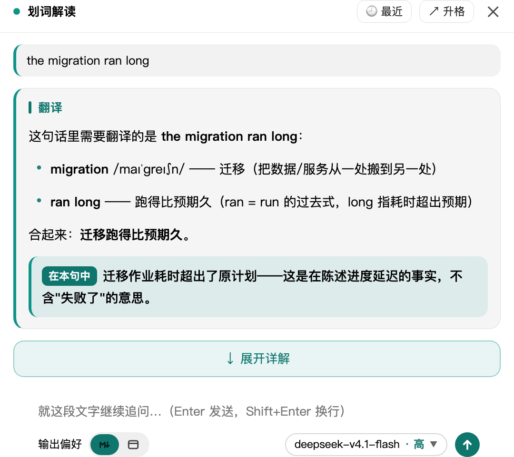
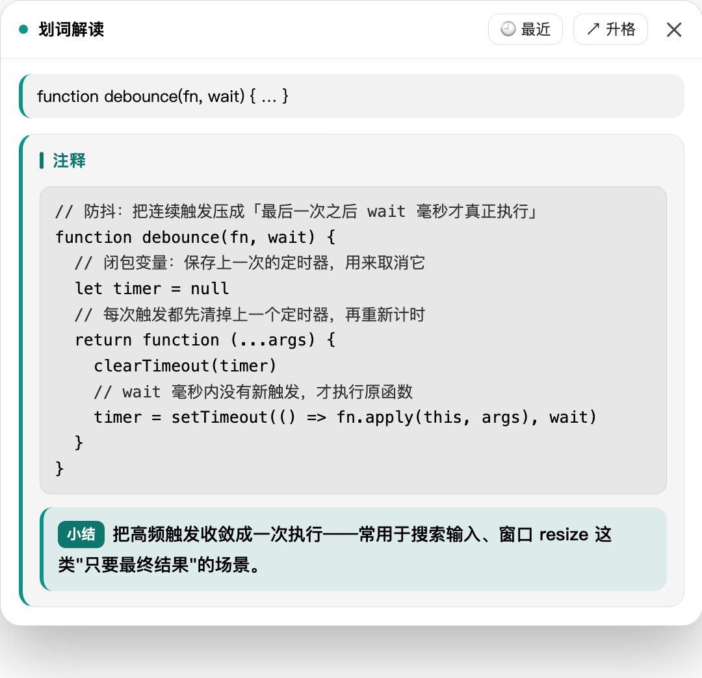
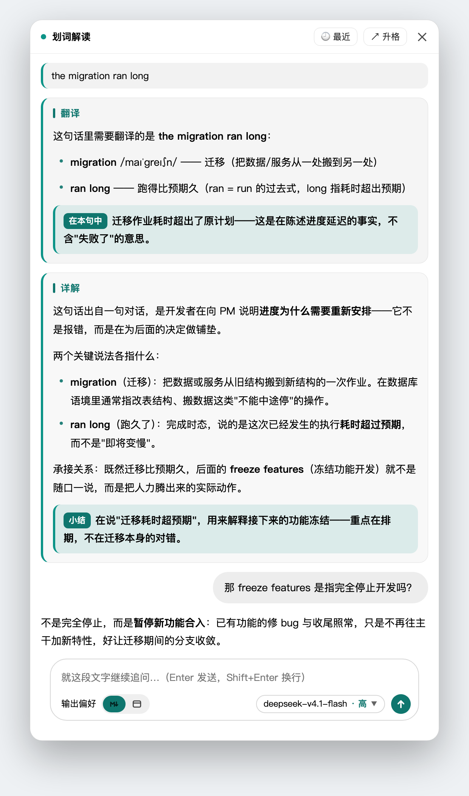
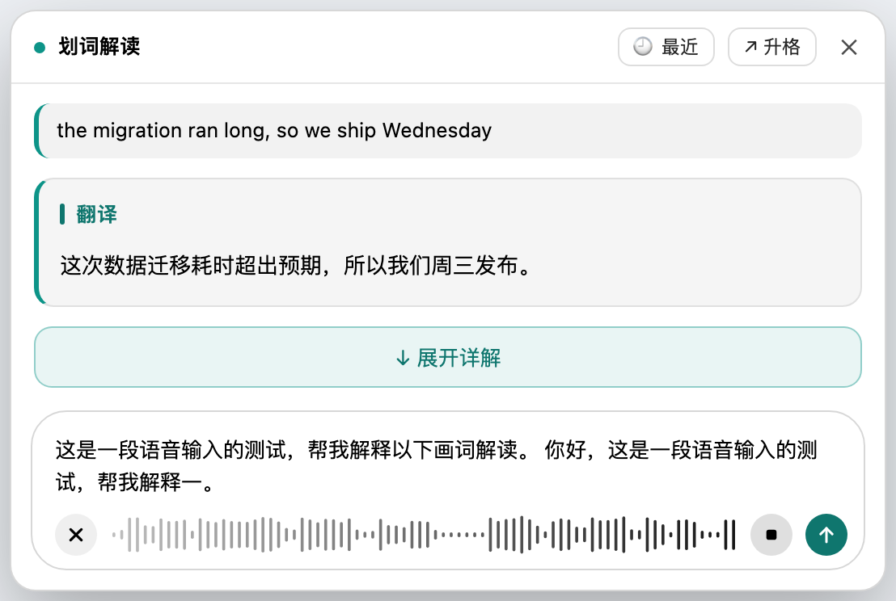
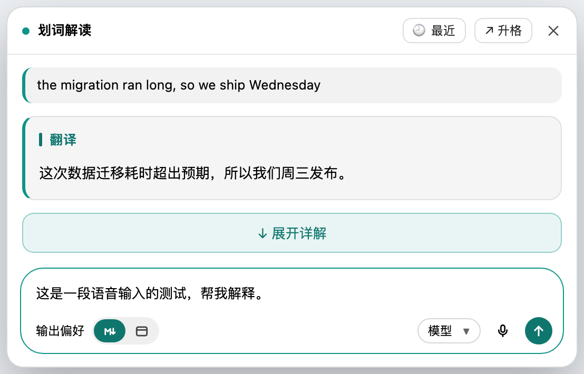
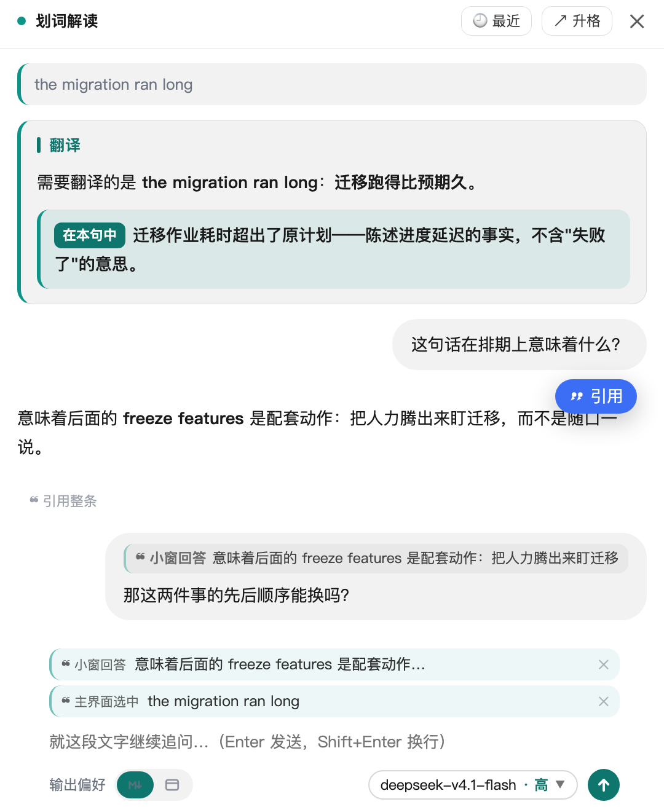
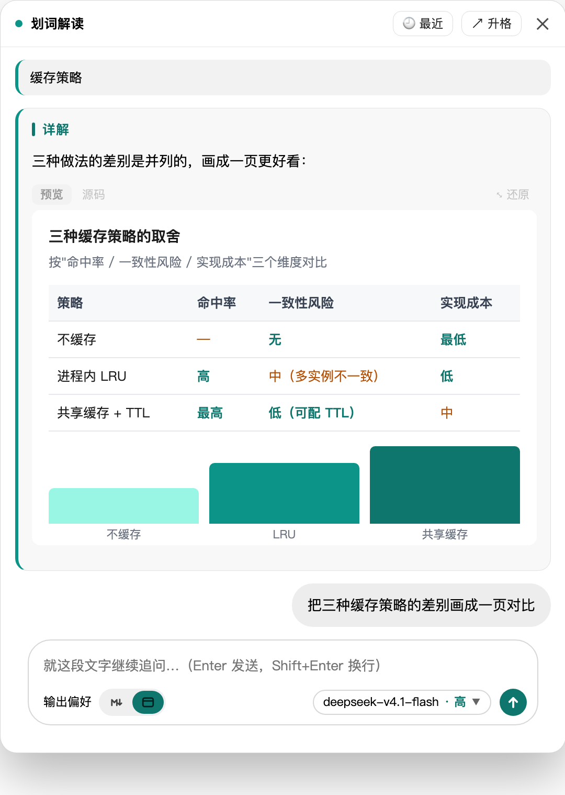

# dsh-selection-explain · 划词解读

> 在 [DSH](https://github.com/deepseek-ai) Web 界面里**选中任意文字**，就地得到**专业翻译** + **这段文字在当前上下文里到底是什么意思**，还能接着追问、或一键升格成正式会话。

[](https://github.com/yfwu2020/dsh-selection-explain/releases)
[](https://www.npmjs.com/package/@yfwu2020/dsh-selection-explain)
[](./package.json)
[](https://github.com/yfwu2020/dsh-selection-explain)

---

## 它解决什么问题

读英文文档、看代码注释、翻聊天记录时，卡住的往往不是"这个词什么意思"，而是**"它在这里什么意思"**：

- `commit` 是"提交"还是"承诺"？`stale closure` 在这个 bug 报告里指哪种闭包？
- 同事写的 "let's circle back on the migration" 到底在安排什么？
- 这段报错里的 `EADDRINUSE`，在当前这个项目里是端口冲突还是残留进程？

普通翻译工具只给词义，**不给语境**。这个插件把**选中文字 + 它周围的内容 + 当前会话的对话背景**一起喂给模型，所以答案能落到"这里"——并且它知道你是在读文档、读代码，还是在跟人对话。

## 功能

### 两段式：先快后深

点开面板**先只出翻译**（上下文窗口收窄到 8 条消息，首字最快）；翻译出来后才出现 **`↓ 展开详解`**，点了才用完整会话背景（24 条消息）做深度解读。想要快就停在第一段，想要透就展开——**不强迫你为深度等首字**。



### 翻译：按选中内容的语言和形态自适应

不是无脑翻译，而是先判断这段文字是什么，只给对应的那一种：

| 选中内容 | 输出 |
| --- | --- |
| 中文句子（夹英文） | 中文部分**不翻译**，只把句中夹着的英文片段逐条译成中文 |
| 中文词 / 词组 | 列常用义项（每行一条） |
| 英文句子 / 词组 | 直接给中文译文 |
| 英文单词 | 逐个义项一行，**带音标** |
| 日 / 韩 / 法 / 德等其他语言 | 译成中文 |

最后固定给一条**结论条**：`> 在本句中：<它在这里的确切含义>`，面板里渲染成高亮条，一眼看到答案。

### 详解：讲透"在这里"的意思

- **先判断来源**：这段文字是真实内容，还是示例 / 测试用例 / 演示输出 / 引用别人的话？是后者就先点明（否则示例句会被当成真实陈述去解释）。
- **专业名词两层讲**：先给通用含义（本领域标准定义或全称），再说它在这段上下文里具体指什么。
- **讲透承接关系**：关键说法各指什么、承接了什么、能推出什么。
- **可以联网**：拿不准或是新出现的名词、缩写、产品名，会先搜索确认再解释，事实融进解释里，不罗列搜索过程。

### 选中代码 → 出注释

如果选中的是代码（在 `<pre>/<code>` 里，或文本特征像代码），首轮标题变成「**注释**」：整个回答是一个代码块，里面是**注释 + 原代码交替**的批注清单——每条语句**前面**一行该语言的注释符号（`//`、`#`、`--`、`<!--`…），原代码逐字不变。注释行弱化显示，一眼分得清哪行是代码、哪行是批注。缩进按原行起始列对齐，折行也不会跑到注释左边。



### 临时对话小窗

翻译一出来就能直接追问，不必先展开详解：

- 输入框 `Enter` 发送、`Shift+Enter` 换行（中文输入法确认候选词的 Enter 不会误发）。
- 回答流式出现，多轮上下文保留。
- 追问可以**联网查证**，但工具日志不进小窗——只给你模型消化后的结论。
- 生成中可以点**停止**打断；没有可用结果时给「重新生成」。
- 关掉面板**不会丢**：点右下角胶囊原样回来，不重新请求。



### 语音输入：不想打字就说话

追问往往只有一两句（"这词在这里是不是贬义？"），可**打字**这件事本身就要把手从鼠标挪到键盘——和"划词"这个动作是矛盾的。输入框右下角因此多了一个麦克风，**交互与主会话的语音输入完全一致**（同一套录音行、同一个波形）：

| 操作 | 结果 |
| --- | --- |
| 点一下 🎤 | 工具行换成**录音行**：`✕` 取消 · **实时波形**（跟着说话强弱） · `■` 停止 |
| **说话的时候** | **字就跟着往输入框里长**：半句预览（说了 1 秒多就出字，之后每 ~1.3 秒刷新）+ 停顿定稿（停 0.6 秒算这句说完，定稿的字不再变） |
| 点 `■` / 到了 60 秒 | 结束录音 → 整段再识别一次做收口（这段时间显示「识别中…」+ 呼吸点） |
| 点 `✕` / 录音中按 `Esc` | 取消这次语音：**松开麦克风**、实时字幕停下；**已经说出来的字留在输入框**（不删字）。`Esc` 只取消这一次语音，**面板留着**（再按一次才关窗） |
| 收起小窗 / 切走这个窗口 | 停录、**松开麦克风**（不会留下"正在使用麦克风"的标识），屏幕上已有的字留着 |
| 录音中把这条消息发出去了 | 停止录音（已经写进输入框的字跟着这条消息发出去） |



- **插进去，不是发出去**：识别结果落在光标处，可以和已经写了一半的话接着拼、改错字、再补第二段。识别有错字是常态，能改才有用。
- **框会跟着字长**：边说边落字时输入框自己往上撑（最多约 7 行，再多就内部滚动并停在最新一行）——字是"自己长出来"的，别指望你会去拖那个框。
- **实时字幕是"预览 + 定稿"两层**：说的过程中每 ~1.3 秒把没说完的半句送去识别一次，半句预览**整段替换**上一拍（窗口固定 ≤10 秒，所以说到第 40 秒也不会变慢）；停 0.6 秒就算这句说完，送一次识别后**定稿**，之后不再变。点 `■` 结束时用整段录音再识别一次收口——**整段结果以已定稿的文字开头就只补后半句，定稿的字一个不动**（对不上才整块替换）。
- **实时字幕只在本地识别器上默认开**：每一拍都是一次识别调用，本机模型不花钱、只占点 CPU（实测 8 秒窗口约 0.2 秒）；云端识别器按次计费，不做预览。拿不到麦克风原始采样（老浏览器）、或你手动改了预览那半句，就自动退回"停止后出字"。
- **音频不落盘、不进会话**：录到的音频只在这一次识别里用一下，host 转写完即丢——不会写进 `~/.dsh`，也不会出现在会话记录里。
- **识别在 host 上做**（装了本地 SenseVoice 就是**在你机器上**）：音频不出机器；识别器走 DSH 的语音识别服务，本机模型 / 云端服务都能用。
- **出错留在录音行里说清是哪一种**：没授权 / 没麦克风设备 / 浏览器不支持 / 没启用识别服务 / 录音太长 / 没听清——各给一句原因 + 一个行内动作（🎤 重录，或模型没准备好时的 **`准备模型`** 按钮，下载在 host 上跑、关掉面板也继续）。按 `✕` 就收起、工具行原样还回来。
- 一次最长 **60 秒**；需要 DSH 装着语音识别服务（`@deepseek-ai/dsh-experimental-speech-to-text`）。没有那个服务时，点麦克风会明说不可用，不会装作在录。



### 引用：把别处的文字带进追问

追问时经常要指着一段东西问——"这段和上面那段矛盾吗"、"按这个格式再来一版"。**引用**就是把那段文字挂到输入框上，跟着这条提问一起发给模型：

| 想引用什么 | 怎么操作 |
| --- | --- |
| **小窗里的内容**（翻译 / 详解 / 某条回答里的几句） | 直接在小窗里划选 → 浮出 `❝ 引用` → 点一下 |
| **主界面上选中的文字**（小窗开着的时候） | 在页面里划选 → 同一个 `❝ 引用` → 点一下（侧边栏网页里划词也一样） |
| **整条回答** | 鼠标移到那条回答上，末尾浮出 `❝ 引用整条`（网页回答会先折成 Markdown，不会引用一整页 HTML 源码） |



- **引用卡片贴在输入框上方**：来源（小窗第 2 轮回答 / 小窗「翻译」节 / 主界面选中 / 侧边栏网页…）+ 内容摘要，右侧 `✕` 单条删除。最多 4 段，重复的不会重复加。
- **引用只带"模型看不到的东西"**：每段引用都写清**出自哪里**；只有材料本身不在模型上下文里时，才额外附上它当时所在的那一段对话。
  - **小窗里的引用**（某条回答 / 翻译节 / 详解节 / 顶部选中文字条）→ **只写出处**（`小窗第 2 轮回答`、`小窗「翻译」节`……）：小窗这几轮对话本来就会随历史进模型，再贴一遍是重复；
  - **主界面（会话）里的引用** → 附上 `【引用处上下文】`：引用所在的**那一组对话 ± 一组**（一组 = 一条用户消息 + 它的回答，被引用的部分用 `【】` 标出），由 host 从**会话记录**里取，工具调用/思考/系统注入全部滤掉；
  - **侧边栏网页里的引用** → 附上网页里选区前后各 1500 字的窗口。
- **发送时才拼进消息**：`【引用 1】（来自小窗第 2 轮回答）` +（需要时）`【引用处上下文】…` + `【我的问题】…` —— 出处/上下文在前、问题在后，用户气泡里也照这个顺序显示，回头翻记录知道当时在问什么。
- **只挂引用、一个字不写也能发**：这时用一句兜底提问（"就上面引用的文字，说说它在这里是什么意思。"），不会空发。
- **只属于下一条提问**：发出即清空；换一段新的选中文字、或从「最近」回放另一段对话时也会清掉（那些引用属于上一次对话）。
- **小窗开着时浮标就是「引用」**：要解读新的一段，先按 `Esc` 收起小窗再划词——避免两个小窗抢同一处选区。
- 引用会**进历史、也进升格**：回放这段对话时引用块跟着回来（以拼好的原文形式），升格出来的正式会话里同样带着。

### 输出偏好：Markdown ↔ 网页

输入区左下角那个两格开关（`M↓` = Markdown / `▭` = 网页）决定**追问的回答用什么形式**。默认是 **Markdown**，选择记在浏览器本地，下次打开还是它。

| 档位 | 行为 |
| --- | --- |
| **Markdown**（默认） | 普通文字 / Markdown 回答——标题、列表、表格、代码块都可以。**并不禁止 HTML**：如果某个问题用一页网页明显讲得更清楚，照样会给网页；只是不会为了"好看"把简单问题做成页面 |
| **网页** | **网页优先**（不是"一律网页"）：需要对比、流程、层级、图表，或文字答案会长到不好读 → 直接给**完整的单文件 HTML**，页面本身就是答案；一两段话能说清的简单问题**仍然用文字回答** |



**网页输出的优点**（也是它值得单独一档的原因）：

- **复杂信息能"看"而不是"读"**：三种方案的取舍做成对照表 + 条形图，一眼看出差别；文字版要读三段才建立同样的印象。
- **页面就是答案，不是附件**：生成的是**完整单文件 HTML**（样式与脚本全内联），小窗当场渲染成可交互页面——能悬停、能点、能滚，不用保存成文件再打开。
- **两个视图随时切**：回答上方有 `预览 / 源码` 两个页签，切到源码就能把 HTML 拿走。
- **默认就整页展示**：预览高度**由页面内容决定**（内部不滚动），所以一页对比表能完整看下来；想收起来点右侧 **`⤡ 还原`**，回到固定高度（320px、内部滚动）。
- **有设计规范兜底**：开网页模式时，插件会把自己带的 `skills/web-design/SKILL.md` 注入提示词——按小窗**约 500px 宽的窄容器**写的单列布局规范，避免生成那种"三栏卡片 + 渐变大标题"的通用 AI 模板感。（该文件读不到时有一份内置兜底，不会因此失败。）
- **回答仍然可追问**：网页结果会作为前情带回下一轮，可以继续说"把第二列改成时间线"。

**什么时候别用网页**：只想要一段解释、或要的是可以直接复制的文本时，Markdown 更快也更省 token——网页要生成一整份 HTML，等待时间和输出长度都更大。

### 「最近聊过的」历史

面板头部 `🕘 最近` 打开独立浮层列表（贴面板侧边，空间不够自动翻到另一侧）。重划同一个词**直接回放上次的对话，一次模型都不调**。默认保留最近 20 个划词条目（每个条目含它自己的全部追问），LRU 淘汰，**升格过的条目不会被淘汰**。

历史落在 `~/.dsh/selection-explain/history.json`，**不建会话**——不污染你的会话列表。

### 升格为正式会话

面板头部 `↗ 升格` 把这次解读（选中文字 + 翻译 / 详解 + 全部追问）变成一个正式会话，建在**来源会话同一个项目下**。临时小窗聊出价值了，就把它变成正式的。

### 悬浮状态胶囊

右下角一枚胶囊显示"最近一次划词现在什么状态"（进行中报阶段和秒数、其余报结果），点一下回到那个小窗。它会自动贴到费用胶囊上方。

### 侧边栏网页里也能划词

侧边栏里显示的**网页**里选中文字，同样会浮出 `✦ 解读` 按钮：解释用**那个网页自己的上下文**（选区前后各 1500 字，`【】`标出选中部分），追问、历史、升格都照常。覆盖两类：

| 谁渲染的网页 | 例子 |
| --- | --- |
| 内置「文档预览」的 HTML 文件预览 | 在侧边栏点开一个 `.html` 文件（预览模式） |
| 其它插件在侧边栏渲染的生成网页 | **「图解」**（`dsh-reply-visual`：模型产出的单文件 HTML 在侧边栏渲染）等 |

为什么需要专门做一层：这些网页都渲染在不透明源沙箱 iframe 里（`sandbox="allow-scripts"`，刻意**没有** `allow-same-origin`），父页面拿不到它的文档，顶层 `window.getSelection()` 永远是空的——划词在那里天然是瞎的。所以插件往被渲染的文档里注入一段**桥脚本**：它在帧内读选区、就地采上下文，再 `postMessage` 报出来；父页面把「帧内坐标 + iframe 的位置」换算成视口坐标，复用同一套浮标与面板。

| 网页形态 | 桥怎么进去 |
| --- | --- |
| **基础预览**（默认，`srcdoc` + `sandbox=""`，宿主已用 DOMPurify 清洗过：无脚本、无外链） | 重写 `srcdoc`：插入桥脚本，把 CSP 的 `script-src 'none'` 放宽成 `'unsafe-inline'`（`default-src 'none'` / `connect-src 'none'` 等其余限制一条不动），沙箱补 `allow-scripts` |
| **交互式预览**（开发者工具打开后：外层是 `blob:` bootstrap + `document.write`） | 取回那份 blob → 插入桥脚本 → 换成一个新的 blob 装上去；桥的监听挂在 `window` 上并用轮询兜底，`document.write` 冲不掉它 |
| **其它插件的生成网页**（如「图解」的 `blob:` 帧） | 同上（取回 blob → 注入 → 换新 blob），但**只桥本来就允许脚本的帧**——不给别人的沙箱加权限 |

**浮现与消失的时机都与主会话一致**：

| 动作 | 结果 |
| --- | --- |
| 拖拽划词（按住鼠标） | **期间不弹**；松手后才浮出，位置是**最终**选区末端 |
| 键盘扩选（`Shift`+方向键） | 松键即弹 |
| 在网页里点一下（取消选区 / 点别处） | **按下就收**（不等松手），选区真没了再补一条清空 |
| 点另一个网页 | 也收（跨帧点击同样算"点了别处"） |
| 点主界面别处 / 滚主界面 / 改窗口大小 | 收（与主会话同一套规则） |
| 页面重绘、动画、字体回流导致的**瞬时**读不到选区 | **不**收（连续 6 拍 ≈1.5s 都读不到才算真没了） |
| 选区滚出网页可视区 | 收（滚回来会重新浮出） |

**安全边界没有退让**：帧始终是不透明源，**不会**加 `allow-same-origin`——网页读不到 GUI 的 DOM / Cookie / localStorage，也不能导航顶层窗口。桥只往外报「选中了什么 + 周围那点文本」。给宿主预览补 `allow-scripts` 是因为那份 HTML 已被清洗成"无脚本"，放宽 `script-src` 之后真正会跑的只有桥自己；别人插件的沙箱一概不碰（只桥它们自己已经开了脚本的帧）。

不想要这个行为就关掉：`bridgeSidebarPreview: false`（见下面的配置表）。

> 不在覆盖范围内：**内置浏览器标签页里的外部站点**（那是远端 URL 的 iframe，插件没有任何注入手段）、以及宿主的**源码视图**（没有 iframe，切回「预览」即可）。用**路由 URL**（而非 `srcdoc`/`blob`）的第三方预览器（如 better-sidebar 自己的 HTML 预览）也不动它——那些的资源配置归它们自己管。

### 零依赖渲染

面板自带 Markdown 渲染器（段落、多级列表、小标题、表格、引用、代码块）和**语法高亮 tokenizer**（自研，零依赖）：注释 / 字符串 / 数字 / 关键字 / 函数名 / 类型 / 标签 / 属性 / 变量 / 运算符分色，按围栏语言标记选规则。配色跟随**面板实际底色**判定，不是看系统偏好——所以 App 深色 + 系统浅色也不会出现深底配深字。文字对比度实测全部 ≥ WCAG AA 4.5。

<!--
  上面几张演示图的来源（要换图看这里）：
  · 图由 scripts/build-demo-pages.mjs 生成演示页 —— 样式直接从 lib/client.js 抽取真实 CSS，
    DOM 结构与文案照 src/client/index.js 的渲染器写，所以和真实面板一致（非手绘示意图）。
  · 截图：Chrome 无头（--headless --screenshot --force-device-scale-factor=2）
  · 裁边：node scripts/crop-png.mjs <in.png> assets/<name>.png 24
  · 想换成真实环境截图，直接用同名文件覆盖 assets/ 下的图片即可。
-->

---

## 安装

### 方式一：从 npm 安装

已发布到 npm registry：

```bash
npm install @yfwu2020/dsh-selection-explain
# 或直接装配进 profile（npm 包名可直接用）
dsh plugin --profile web add @yfwu2020/dsh-selection-explain
```

### 方式二：从 Release 安装

每个 Release 都附了**构建好的 `.tgz`**（含 `lib/` 产物，装完即可用，无需 clone 源码）。
用 `latest` 路径可以不写版本号、永远取最新：

```bash
# 下载最新 release 的安装包（无需知道版本号）
VER=$(curl -sI https://github.com/yfwu2020/dsh-selection-explain/releases/latest | grep -i '^location:' | sed 's|.*/tag/v||' | tr -d '\r\n')
curl -LO "https://github.com/yfwu2020/dsh-selection-explain/releases/download/v$VER/yfwu2020-dsh-selection-explain-$VER.tgz"

# 解包到插件目录
mkdir -p ~/.dsh/plugins/dsh-selection-explain
tar -xzf "yfwu2020-dsh-selection-explain-$VER.tgz" \
  -C ~/.dsh/plugins/dsh-selection-explain --strip-components=1

# 装配到 profile（重启后由官方接管）
dsh plugin --profile web add ~/.dsh/plugins/dsh-selection-explain
```

> 也可以直接下某个固定版本，把上面的 `$VER` 换成版本号即可，例如
> `.../releases/download/v0.1.2/yfwu2020-dsh-selection-explain-0.1.2.tgz`。

### 方式三：从源码安装

```bash
git clone git@github.com:yfwu2020/dsh-selection-explain.git
cd dsh-selection-explain

# 装依赖（编译用的 @deepseek-ai/* 类型与 tsc 都在 devDependencies 里）
npm install

# 构建（自动探测 DSH 运行时；host 走 tsc，client 是手写 bundle 直接拷贝）
bash scripts/build.sh

# 装配
dsh plugin --profile web add .
```

> `scripts/build.sh` 会按顺序探测 DSH 运行时：**项目自己的 `node_modules`**（CI/`npm install` 走这条）
> → `DSH_CHECKOUT` → PATH 上的 `dsh` → 常见 checkout → npx 缓存。
> 探测不到时可以显式指定：`DSH_CHECKOUT=/path/to/dsh-harness bash scripts/build.sh`。

装好后**刷新页面**，选中文字试试。浏览器控制台会打印 `[dsh-selection-explain] 划词解读已就绪（选中文字试试）`。

### 卸载

```bash
dsh plugin --profile web remove @yfwu2020/dsh-selection-explain
```

---

## 用法

| 动作 | 结果 |
| --- | --- |
| **鼠标划选** / `Shift` + 方向键 | 选区末端浮出 `✦ 解读` 药丸按钮（✦ 是图标，按钮文字是「解读」；输入框内的选择不触发，避免干扰打字）。侧边栏的 HTML 文件预览里同样生效 |
| 点击按钮 | 弹出面板：顶部是选中文字，正文是「翻译」卡片 |
| 点 `↓ 展开详解` | 加载完整会话背景，追加「详解」卡片 |
| 面板底部输入框 | 就这段文字继续追问（`Enter` 发送 / `Shift+Enter` 换行） |
| 输入框右边 🎤 | **语音输入**（与主会话同一套 UI）：点一下开始说，`■` 结束并把文字插进输入框、`✕` 取消（`Esc` 同样取消，一次最长 60 秒） |
| 小窗开着时划词 | 浮出的是 `❝ 引用`（不是 `✦ 解读`）：把这段文字挂进输入框的引用区，跟着下一条提问发给模型 |
| 鼠标移到某条回答上 | 末尾浮出 `❝ 引用整条`：把整条回答挂进引用区（网页回答先折成 Markdown） |
| `🕘 最近` | 打开最近划过的列表，点一条调回那段对话 |
| `↗ 升格` | 把这次解读变成正式会话 |
| `✕` / `Esc` | 关闭面板。**语音进行中按 `Esc` 只取消这次语音（等价于点 `✕`，已说出来的字留着），面板留着**；再按一次才关窗 |
| 右下角悬浮胶囊 | 点一下：关着就回到最近一次小窗，开着就收起（来回切换，不重新请求） |

**几个不别扭的细节：**

- **点面板外不会关闭面板**。答案留在原地，只有 `✕` / `Esc` / 右下角胶囊能收起——不会因为手滑点一下就得重新问。
- **输入框跟着内容长高**：写（或说）到第二行就自己撑开，最多约 7 行（132px）；再长就内部滚动并**自动停在最新一行**——不会像以前那样第二行以下的字被裁掉。
- **开窗即能打字**：小窗打开、输入框出现后会自动获得焦点（只有"你正在别处打字"时才不抢）。`Tab` 也能摸到输入框和 🎤。
- **说话时看得见光标在跳**：录音一开始光标就落在输入框里，预览每落一句、光标跟到最新文字末尾——像个正在打字的人，而不是一坨自己冒出来的字。
- 关闭时**会中止正在飞的请求**，并记成「已停止」（不是失败）；内容都留着，点胶囊回来还是原样。
- 拖动面板：抓头部即可拖动。
- 追问时消息区**贴底跟随**；你主动往上翻就不会被拽回去。
- `🕘 最近` 的列表点别处就收（不连带关面板），但 `Esc` 会把面板和它一起收。
- **引用是"下一条提问"的**：发出去就清空；引用卡片上的 `✕` 可以单条撤掉；最多 4 段。

### 调试钩子

浏览器控制台里可以直接驱动，方便验证渲染链路：

```js
window.__dshSelectionExplain.open('the migration ran long', 'Dev: the migration ran long, so we ship Wednesday.')
window.__dshSelectionExplain.state()   // { phase, chars, model, sections }
window.__dshSelectionExplain.ping()    // 当前模型路由与限制
window.__dshSelectionExplain.bridge()  // 侧边栏网页划词桥：{ on, frames:[{connected,own,srcdoc,sandbox}], active, selection }
window.__dshSelectionExplain.selection() // 当前选区：{ text, source:'document'|'iframe', label, context }
window.__dshSelectionExplain.quotes()    // 待发送的引用：[{ id, label, text, context, contextChars, session }]
window.__dshSelectionExplain.quote('某段文字', '主界面选中') // 手工加一段引用（等价于点浮标）
window.__dshSelectionExplain.compose()   // 引用 + 提问拼出来的那条消息原文（发给模型的就是它）
window.__dshSelectionExplain.quoteState() // 引用浮标：{ visible, selection:{text,label,source}, panelOpen }
window.__dshSelectionExplain.voice()        // 语音输入：{ phase, capture, activity, dot, waveform, stop, action, bars, lastText, catalog, live:{ active, committed, preview, passes, rewritten, tap } }
window.__dshSelectionExplain.voiceTick()    // 手动催一拍实时字幕（测试用，不用等 1.3 秒节流）
window.__dshSelectionExplain.voiceNode()    // 🎤 触发键节点（无头环境里可能挂了两棵树，用它拿真正带监听的那个）
window.__dshSelectionExplain.voiceNodes()   // 录音行的各部件：{ row, cancel, wave, activity, action, stop }
window.__dshSelectionExplain.askValue()     // 读追问输入框（传参即写入），用来验"转写文字插进去了"
```

### HTTP 接口

host 半注册了同源路由，可以单独调用：

| 路由 | 说明 |
| --- | --- |
| `POST /selection-explain/api/analyze` | 选中文字 + 上下文 → **SSE 流式**返回翻译与详解 |
| `GET /selection-explain/api/ping` | 健康检查：当前模型路由、各阶段推理档位、限制 |
| `GET /selection-explain/api/models` | 可选模型列表（面板里的模型选择器用） |
| `GET/POST /selection-explain/api/history` | 小窗对话历史的读 / 写 / 删除 |
| `POST /selection-explain/api/quote-context` | 引用上下文：`{ sessionId, text }` → 该引用所在的**一组对话 ± 一组**（`{ matched, context, rounds }`；定位不到时 `matched:false`，客户端退回自己采的局部上下文） |
| `POST /selection-explain/api/promote` | 升格为正式会话 |
| `GET /selection-explain/api/speech` | 语音输入：识别器目录与就绪状态（`{ available, providers:[{id,phase}], limits:{maxSeconds,maxBytes} }`） |
| `POST /selection-explain/api/speech/transcribe` | 一段 **16kHz 单声道 PCM16 WAV**（base64）→ 文字：`{ audioBase64, language?, providerId? }` |
| `POST /selection-explain/api/speech/prepare` | 显式准备本地识别模型（首次要下载，只在用户点了提示里的「准备模型」时调用） |

转写示例（`SPEECH_WAV` 是一段规范 WAV）：

```bash
node -e 'const fs=require("fs");const b=fs.readFileSync(process.argv[1]);process.stdout.write(JSON.stringify({audioBase64:b.toString("base64")}))' /tmp/v.wav > /tmp/v.json
curl -s -X POST http://127.0.0.1:3080/selection-explain/api/speech/transcribe \
  -H 'content-type: application/json' --data-binary @/tmp/v.json
# → {"ok":true,"text":"这是一段语音输入的测试…","providerId":"sensevoice-local",...}
```

健康检查示例：

```bash
curl -s http://127.0.0.1:3080/selection-explain/api/ping
```

---

## 配置

配置写在 profile 的 `cordis.patch.yml` 里同 id 的行上（`dsh plugin add` 装好后，包自带的 `cordis.patch.yml` 里已有可改的样板）：

```yaml
- insert:
    - id: selection-explain
      name: '@yfwu2020/dsh-selection-explain'
      config:
        reasoningEffort: high
        sessionContextMaxMessages: 24
```

**下表默认值取自 `src/index.ts` 的 `Config` schema，也就是推荐值。** 不填即用默认。

### 模型与推理

| 字段 | 默认 | 说明 |
| --- | --- | --- |
| `provider` | `''` | 固定 provider 路由；留空 = 跟随「设置 → 默认模型」 |
| `model` | `''` | 固定 model id；留空 = 跟随默认模型 |
| `reasoningEffort` | `high` | **详解**阶段推理档位（`off` / `low` / `high` / `max`） |
| `translationReasoningEffort` | `low` | **首轮翻译**单独一档。这一轮只需挑英文片段，压低换首字速度 |
| `chatReasoningEffort` | `high` | **追问**档位（追问要准不要快；想更快可调 `low`） |
| `temperature` | `-1` | 采样温度。**`-1` = 不传**，交给供应商默认（与主会话一致）；`0`~`2` 之间才真的传 |
| `maxTokens` | `0` | 单次输出上限（tokens）。**`0` = 不限制**。填正数可控成本 / 控时延 |
| `timeoutMs` | `300000` | 单次调用超时（含工具轮；客户端断开即中止上游） |

> 推理档位三档分开是有原因的：翻译不需要深度推理，详解需要。默认 `translationReasoningEffort: low` 让首字快、`reasoningEffort: high` 让详解细。

### 上下文与缓存

| 字段 | 默认 | 说明 |
| --- | --- | --- |
| `maxSelectionChars` | `4000` | 选中文字长度上限（超了不出现按钮，host 侧也会拦截并给出明确报错） |
| `maxContextChars` | `12000` | 局部上下文上限（选区前后各取一段窗口） |
| `sessionContext` | `true` | 是否注入当前会话的对话背景（判断指代与前提的关键） |
| `sessionContextFastMessages` | `8` | **首轮翻译**用的背景条数；越小首字越快 |
| `sessionContextMaxMessages` | `24` | **详解 / 追问**用的背景条数（自选中文字所在消息向上取） |
| `sessionContextMaxChars` | `0` | 会话背景字符上限；**`0` = 不限**（只按条数取窗口） |
| `quoteContextRounds` | `1` | **引用**带几组上下文：引用所在那一组对话 ± 这么多组（一组 = 用户消息 + 它的回答） |
| `quoteContextMaxCharsPerTurn` | `2000` | 引用上下文里单条消息的上限（超了**围绕引用**截断，不裁掉引用本身） |
| `quoteContextMaxChars` | `6000` | 引用上下文整段上限（超了先丢最早的、再丢引用之后的） |
| `resultCacheTtlMs` | `600000` | 共享结果缓存 TTL（毫秒）；`0` = 关闭 |
| `historyMaxEntries` | `20` | 小窗对话历史保留多少个划词条目；`0` = 关闭历史 |
| `maxRequestsPerMinute` | `40` | 本地限流，防误触发刷爆额度 |
| `bridgeSidebarPreview` | `true` | 侧边栏 HTML 预览里的划词桥。关掉 = 预览网页里选中文字不再弹按钮（预览帧不再补 `allow-scripts`，也不注入桥脚本） |

### 工具（联网 / 文件）

| 字段 | 默认 | 说明 |
| --- | --- | --- |
| `tools` | `true` | 是否允许解读过程调用工具 |
| `toolNames` | `advanced_search,platform_search,read,grep,glob` | 工具白名单（逗号分隔）。默认用 free-search 插件的搜索工具，支持多引擎、时间过滤、平台搜索 |
| `fallbackToolNames` | `web_search` | **备用**清单：只在首选里的联网工具一个都不在时才补进来（没装 free-search 时兜底） |
| `maxToolRounds` | `2` | 最多几轮工具调用（用完会补一轮不带工具的收尾，避免"转半天没回答"） |
| `toolResultMaxChars` | `3000` | 单个工具结果注入模型前的字符上限 |
| `toolReadRoot` | `''` | 文件类工具（`read`/`grep`/`glob`）的读取边界：`''` = 会话工作目录，`'*'` = 不限制，其他 = 指定目录。越界在**执行前**被拒 |

---

## 工作原理

```
浏览器（client half，挂在官方 shell.overlay 槽 —— 帧级浮层，不遮挡 App）
  ① 监听 selection（mouseup / Shift+方向键）→ 在选区末端定位浮标
  ② 点击后采集三段信息：
     · 局部上下文：选区所在容器文本中，选区前后各 1500 字的窗口，【】标出选中部分
     · 所在位置：容器类型（对话消息 / 代码块 / 表格 / 页面内容）+ 页面标题与地址
     · 当前会话 id
  ③ POST /selection-explain/api/analyze → SSE 边收边渲染
                                            ↓
宿主（host half，进程内）
  ④ 解析模型路由：默认取「设置 → 默认模型」
  ⑤ 会话背景：按会话 id 读该会话的真实对话（工具调用 / 系统提示 / harness 注入内容全部剔除），
     从最新往前取到预算上限，并把选中文字所在的那条标 ▶
  ⑥ 组两节提示词 → ctx.llm.stream(...) → text-delta 直接透传 SSE
     （reasoning-delta 另走 thought 事件，只喂"正在想什么"那一行，不参与正文）
```

**几个设计取舍：**

- **不建会话**：小窗对话落在插件自己的 `history.json` 里。会话是重型对象，高频功能那样做只会堆死会话列表。
- **缓存 key 不含选中文字之后的内容**：否则主会话后面追加新消息时，同一个词的 key 就变了，表现为"找不着上次的小窗、又生成一个"。
- **上下文窗口锚定选中文字所在的那条消息**，向上取——不是简单取最近 N 条，这样"这个词在这段对话里什么意思"才有前提。
- **侧边栏预览里的选区由帧内桥上报**：那段上下文是在**帧内**用同一套算法（容器 ≥120 字、前后各 1500 字、`【】`标记、key 只取选中前 300 字）算出来的，所以侧边栏网页里的解释质量与主会话里一致，而不是退化成"只有选中文字、没有上下文"。

---

## 自检与开发

```bash
npm run build       # 构建（= bash scripts/build.sh）
npm test            # 600+ 条断言（filters / prompt / bridge / smoke / client / transcript / guard / speech / voice）
npm run test:smoke  # 只跑划词桥的真浏览器冒烟（本机 Chrome；找不到自动 SKIP）
npm run test:voice  # 只跑语音输入的真浏览器冒烟（Chrome + 假麦克风 + 真识别；缺东西自动 SKIP）
npm run typecheck   # tsc --noEmit
```

| 脚本 | 用途 |
| --- | --- |
| `scripts/test-client.mjs` | 无浏览器集成测试：真实 host 路由 + 最小 DOM 桩，覆盖槽注册 → 划词浮标 → 点击 → SSE 流式渲染 → 两节内容 → 侧边栏网页划词桥（注入 / 来源校验 / 坐标换算 / 帧内清空）→ 清理（host 不在跑时自动跳过在线断言） |
| `scripts/test-bridge.mjs` | **划词桥单测**（无需宿主）：从 bundle 里抠出桥脚本与注入函数单独跑 —— 插在哪、CSP 只放宽哪一条、沙箱补哪个 token、帧内报出来的文字 / `【】`上下文 / `keyContext` / 坐标对不对 |
| `scripts/smoke-bridge.mjs` | **划词桥真浏览器冒烟**（本机 Chrome，找不到就 SKIP）：起临时 http 服务，用两种预览形态（`srcdoc` / `blob` bootstrap）验沙箱 + CSP + 跨不透明源 postMessage + `document.write` 冲不掉监听 |
| `scripts/test-prompt.mjs` | **提示词契约测试**：把两节结构标题、结论条格式、音标规则、详解来源判断、追问网页模式要求等关键约束固化成断言，误删即 CI 红 |
| `scripts/test-filters.mjs` | host 侧流式过滤器单测（思考泄漏、工具调用残渣等） |
| `scripts/test-transcript.mjs` | 会话背景窗口的离线测试（锚点 / 条数 / 不截断 / 噪音剔除 / 退化路径） |
| `scripts/test-guard.mjs` | 文件工具读取边界的路径校验 |
| `scripts/test-speech.mjs` | **语音输入契约 + 真路由**：`validateWave` 逐字段打表（采样率/声道/位深/长度字段/多余 chunk 全都要拒）+ 真 host 的三个语音路由（坏 base64 / 非规范 WAV / 超大音频 / 非 POST / 正弦波不会"听"成话）；给了 `SPEECH_WAV=/tmp/v.wav` 还会真识别一句 |
| `scripts/smoke-voice.mjs` | **语音输入真浏览器冒烟**：headless Chrome + `--use-file-for-fake-audio-capture` 把一段真人语音当麦克风，页面里跑**真的 lib/client.js**，走完 录音 → MediaRecorder → 重采样 → WAV → 真 host 识别 → 插进输入框；顺带断言浏览器产出的 WAV 能过 host 的逐字段校验（缺 Chrome / 缺 `say` / host 没在跑都自动 SKIP） |
| `scripts/dump-prompt.mjs` | 打印实际注入的提示词（system + user + 各段尺寸），排查"模型到底看到了什么" |

```bash
# 看某次解读到底喂了什么
node scripts/dump-prompt.mjs <sessionId> "<选中文字>"
node scripts/dump-prompt.mjs --no-session "<选中文字>"   # 不带会话背景的对照组
```

## 发布（维护者）

发布走 **Trusted Publishing**（GitHub OIDC），**不需要任何长期 npm token**：

```bash
# 1) 改 package.json 的 version（例如 0.2.0）
# 2) 打同名 tag 推上去
git tag v0.2.0 && git push origin v0.2.0
```

`.github/workflows/publish.yml` 会自动：校验 tag 与 `version` 一致 → `npm install` → 构建 → 跑全量测试（`npm test`，含真浏览器冒烟，CI 里自动 SKIP）→ 类型检查 → `npm publish --provenance`（附 provenance 签名）。

npm 侧只需配一次：包设置 → **Trusted Publisher** → GitHub Actions，填 `yfwu2020` / `dsh-selection-explain` / `publish.yml`，并勾选允许 **`npm publish`**（默认只允许 `npm stage publish`）。

> 注意：`devDependencies` 里的 `@deepseek-ai/*` 钉在 **`0.1.5-rc.3`**（与插件开发所依据的运行时一致）。
> npm 上这些包的 `latest` 还停在 `0.0.1-rc.x`，API 更旧（缺 `WebServer`、`createSystemMessage` 等），
> 用 `latest` 会编译失败——升级运行时时要同步改这里。

## 目录

```
src/index.ts            host 半：SSE 路由 / 模型调用 / 会话背景 / 历史落盘 / 过滤器
src/prompts.ts          提示词与写作规则（纯字符串常量，无逻辑）
src/client/index.js     client 半：划词浮标 + 面板 + 渲染器（手写 ModuleLoader bundle，无打包器）
scripts/                build.sh + 5 个测试 + dump-prompt + 演示图生成
skills/web-design/      网页模式注入的设计规范（运行时读取）
assets/                 README 的演示图（由 scripts/build-demo-pages.mjs 生成）
cordis.patch.yml        官方装配用的 bundle patch
lib/                    构建产物（已 gitignore，克隆后需 npm run build）
```

> **`docs/` 不在本仓库中**：开发期的资料（UI 比选实验台——浮标动效 / 模型选择器 / 折叠实验台 /
> 配色方案等，以及含本机路径与逐轮实测记录的内部开发文档）**仅保留在开发者本地**，已在 `.gitignore`
> 中整体排除，也从未进入 npm 包。它们记录的是"当初为什么这么设计"，与插件运行无关。

## 已知限制

- 主会话（以及 DSH 界面本身）里只覆盖**同源页面内**的选中文字。
- 侧边栏 **HTML 文件预览**已覆盖（靠帧内桥，见上）；但**内置浏览器标签页里的外部站点**（远端 URL 的 iframe，插件没有任何注入手段）与**源码视图**（没有 iframe）不触发。
- 预览帧被换成路由 URL 而非 `srcdoc`/`blob` 的第三方预览器不接管（不动别人的资源改写与生命周期）。
- 面板**不跟随页面滚动**（滚动即收起浮标 / 面板），符合「划完即看」的一次性使用预期；侧边栏网页内部滚动会重新上报位置，浮标跟着走。
- **小窗里的网页回答预览（iframe）内部**划不了词（不透明源帧，插件不桥自己的预览）：想引用它就用气泡末尾的 `❝ 引用整条`，或切到「源码」视图再划。
- 结论来自当前模型，专业领域术语请以人工判断为准。
- 依赖 DSH 的 `webServer` 与 `llm` 服务；宿主版本过旧可能不兼容（peerDependencies 见 `package.json`）。
- **语音输入**还需要宿主的语音识别服务（`@deepseek-ai/dsh-experimental-speech-to-text` + 一个识别器，例如本机 SenseVoice）。没装 / 没准备模型时，麦克风按钮会明说原因，不会静默失败。识别器只收 **16kHz 单声道 PCM16 WAV**（插件在浏览器里按这个格式编码）；一次最长 60 秒，**不做边录边出的流式识别**（说完再转，一次给全）。

## License

MIT
